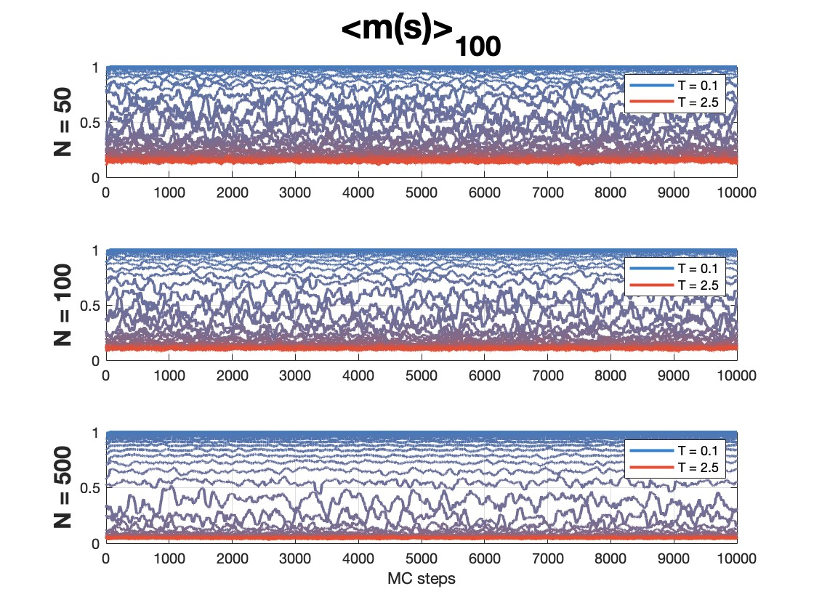

# Ising model with super long-range interactions ⚡️
This repository includes:
-  Final project pdf. This is composed of an **analytic analysis** of the model and an exploration of the **Monte Carlo simulation** results.
-  Python code to run MC simulations of the model (for the case of zero field)

This was initally developed as a project for my Statistical Physics course, but I later revisited the project and improved it.

## Running the code
1. Simply run main.py . You will be asked to input the number of spins and the number of Monte Carlo steps to perform (see pdf). Higher values result in slower simulations, I recommend starting with 50 spins and 10000 steps to experiment.
2. The progress is displayed in real-time.
3. Once finished, a folder is created with the results of the run: A file with the mean magnetization per spin and total energy of each of the MC samples, for each of the temperatures. **Attention**: the file name only depends on N, so be careful with over-writing previous results.


## Processed results (from MC simulations)
<p align="center">


</p>


## Analytical results (from project)
Some of the relevant equations from the project:
``` math
\begin{gather*} E = \frac{J}{2} - HM - \frac{J}{2N} M^2 \quad \quad m = \tanh{ \left( \frac{J}{k_BT} (m + \frac{H}{J}) \right)} \\  c_V(T,H) = \frac{J}{T} \frac{1-m^2}{m^2 - \left( 1-\frac{k_B T}{J} \right)} \left( m^2 + \frac{H}{J}m\right) \quad \quad \chi _M(T, H) = \frac{1}{J} \frac{1-m^2}{m^2-\left( 1- \frac{k_B T}{J}\right)} \end{gather*}
```

 ``` math
\begin{tabular}{c c}
E = \frac{J}{2} - HM - \frac{J}{2N} M^2  &  m = \tanh{ \left( \frac{J}{k_BT} (m + \frac{H}{J}) \right)} \\ 
c_V(T,H) = \frac{J}{T} \frac{1-m^2}{m^2 - \left( 1-\frac{k_B T}{J} \right)} \left( m^2 + \frac{H}{J}m\right)  &  \chi _M(T, H) = \frac{1}{J} \frac{1-m^2}{m^2-\left( 1- \frac{k_B T}{J}\right)}
\end{tabular}
```


<p align="center">


</p>
